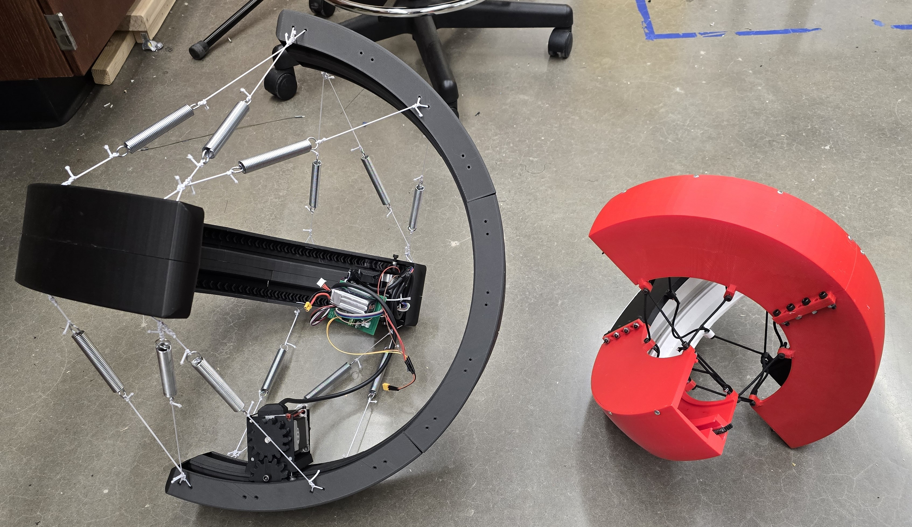
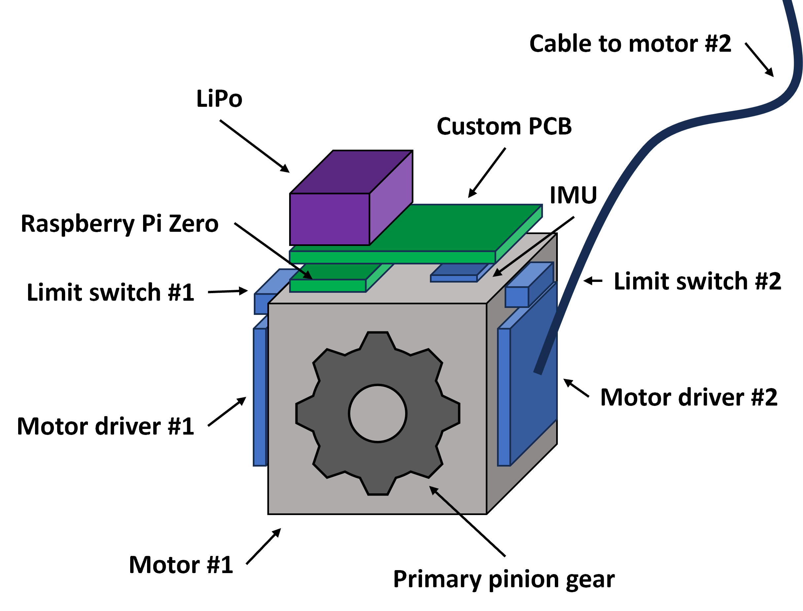

# TeXploR-quasi

[](https://icra2026.org/)
[](https://arxiv.org)

This repository contains the system design documentation and quasistatic simulation for **TeXploR2** (Tensegrity eXploratory Robot 2), a curved-link tensegrity robot capable of dynamic rolling locomotion through internal mass shifting. This work represents a significant advancement over the [original TeXploR](https://github.com/lefaris/TeXploR-geometric).  This repo is supplemental for **System Design of Tensegrity Robot Exhibiting Non-Intuitive Behavior** accepted to IEEE ICRA 2026.

---


*TeXploR2 (left, black) compared to the original TeXploR (right, red). TeXploR2 is completely redesigned for smoother dynamic movement regardless of shifting mass orientation (e.g., hanging upside down). The prototype is also significantly larger for additional central payload capabilities.*

## Overview

TeXploR2 is a curved-link tensegrity robot that achieves efficient rolling while maintaining stability through discontinuities present at arc endpoints. Unlike traditional straight-link tensegrity robots that contain slower toppling/walking locomotion gaits, TeXploR2's spherical-like design enables rolling.

### Key Contributions

This work showcases the system design for the TeXploR2 prototype. We also introduce non-intuitive state switching behavior that enables state transitions without requiring the shifting mass to reach arc endpoints. This enables faster state jumping and trajectory control.

- **Updated System Design**: More robust prototype capable of real-time tetherless locomotion
- **Non-Intuitive Control**: Efficient state jumping achievable along boundary lines
- **Shock Absorption**: Compliant tensegrity structure withstands impacts
- **Modular Modeling Framework and Design**: Scalable to additional curved links for finer control

---
## Demos

### Shifting Mass


### Rolling Locomotion


### Impact Test


---

## Repository Structure

```
TeXploR-quasi/
├── quasistatic_modeling/   # MATLAB quasistatic simulation code
│   └── visualization/      # Simulation visualization
├── experiments/            # Motion capture data and test scripts
├── design_files/           # TeXploR2 design files
│   ├── CAD/                # Fusion files
│   └── PCB/                # KiCAD files
└── figures/                # Demo figures/videos
```

---

## Getting Started

### Prerequisites

- MATLAB R2020b or later
- Optional: Python 3.x (for hardware integration)

### Installation

1. **Clone the repository**
   ```bash
   git clone https://github.com/lefaris/TeXploR-quasi.git
   cd TeXploR-quasi
   ```

2. **Set up MATLAB path**
   ```matlab
   addpath(genpath('quasistatic_modeling'))
   ```

3. **Run quasistatic simulation**
   ```matlab
   cd quasistatic_modeling
   run('TExploRStaticsDerivationsQuasi3(0, 90)')
   ```

---

## System Design

### Mechanical Properties

| Component | Specification |
|-----------|--------------|
| **Arc Diameter** | 585mm (vs. 403mm TeXploR v1) |
| **Arc Width** | 98mm (vs. 83mm TeXploR v1) |
| **Arc Mass** | ~1,300g each |
| **Shifting Mass** | 1,150g each |
| **Mass Ratio** | 0.88:1 (shifting:arc) |
| **Material** | Onyx (Markforged) |

### Electronics

- **Controller**: Raspberry Pi Zero 2W
- **Motors**: Dual-shaft NEMA23 bipolar stepper motors (200 steps/rev)
- **Motor Drivers**: TB67S128FTG high-current carriers
- **Sensors**: 9-axis IMU (I2C)
- **Power**: 11.4V 1.5Ah LiPo battery
- **Control**: Open-loop with SSH remote control
- **Board**: Custom PCB



### Motor Carriage Design

- **T-track latching**: For precise alignment
- **8 v-groove bearings**: (4 horizontal, 4 vertical) to prevent rotation and maintain grip
- **6 ball bearings**: For smooth rolling along arc curvature
- **Herringbone gear teeth**: For smooth power transmission at high loads


### Arc Design

- **Dual internal gear racks**: Parallel along inner curvature
- **Matching Pinion gears**: Driven by dual-shaft NEMA23 motor
- **Symmetric mass distribution**: Minimizes model discrepancies
- **98mm width**: Minimum for NEMA23 integration


---

## Citation

If you use this work in your research, please cite both papers:

### TeXploR2 (ICRA 2026)

```bibtex
@inproceedings{texplor2_2026,
  title={System Design of Tensegrity Robot Exhibiting Non-Intuitive Behavior},
  author={Ervin, Lauren and Bezawada, Harish and Vikas, Vishesh},
  booktitle={2026 IEEE International Conference on Robotics and Automation (ICRA)},
  year={2026},
  organization={IEEE}
}
```
**arXiv preprint:** [arXiv](https://arxiv.org) (Coming Soon)

### TeXploR Geometric Modeling (IEEE RA-L 2024)

```bibtex
@article{texplor_2024,
  title={Geometric Static Modeling Framework for Piecewise-Continuous Curved-Link Multi Point-of-Contact Tensegrity Robots},
  author={Ervin, Lauren and Vikas, Vishesh},
  journal={IEEE Robotics and Automation Letters},
  year={2024},
  volume={9},
  number={12},
  pages={11066-11073},
  doi={10.1109/LRA.2024.3486199}
}
```

---

## Updates

- **January 2026:** Paper accepted to IEEE ICRA 2026
- **September 2025:** Version 2 of [TeXploR robot design](https://github.com/lefaris/TeXploR-geometric) submitted to IEEE ICRA 2026

---

## License

This project is released for academic and research purposes.
